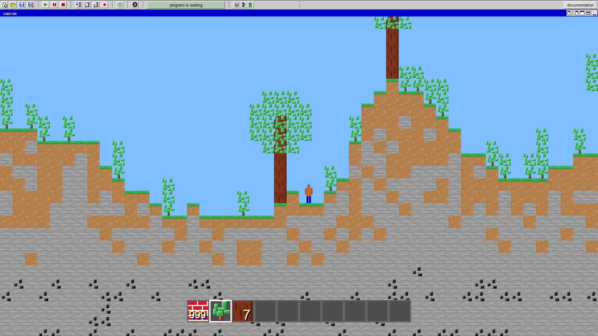
The player spawns somewhere in the wilderness, the world is infinite

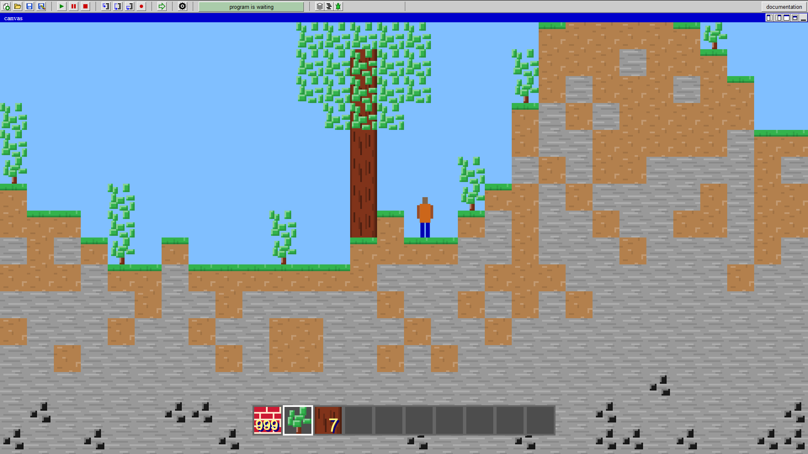
You can chop wood

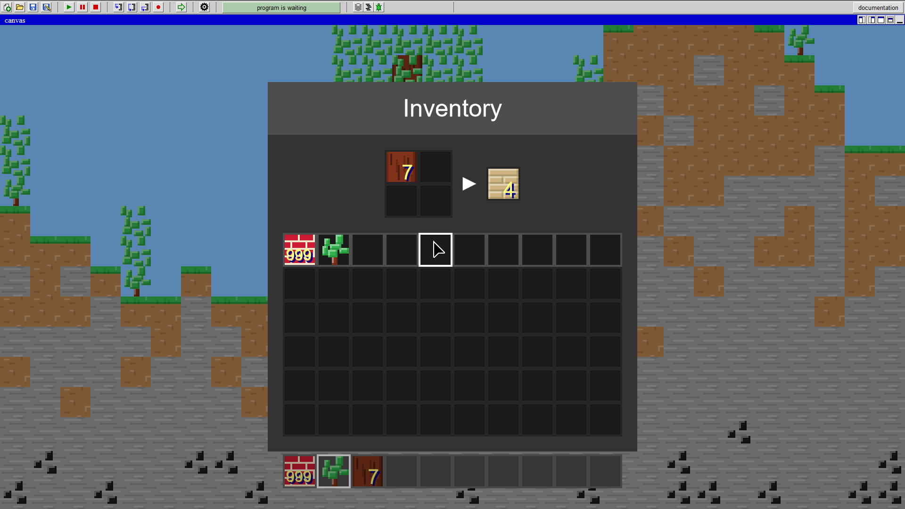
You can convert the wood into planks

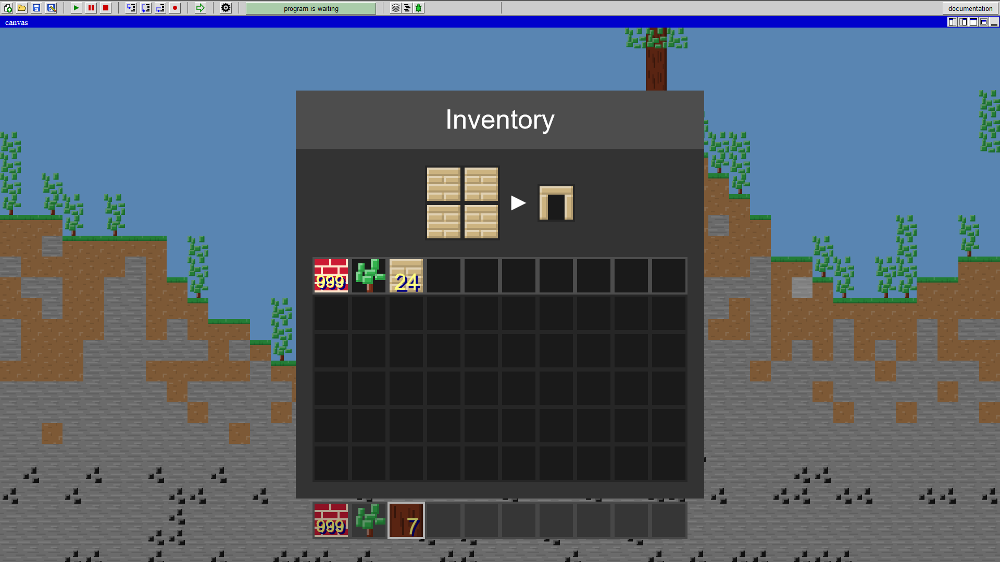
The planks can be used to craft a workbench

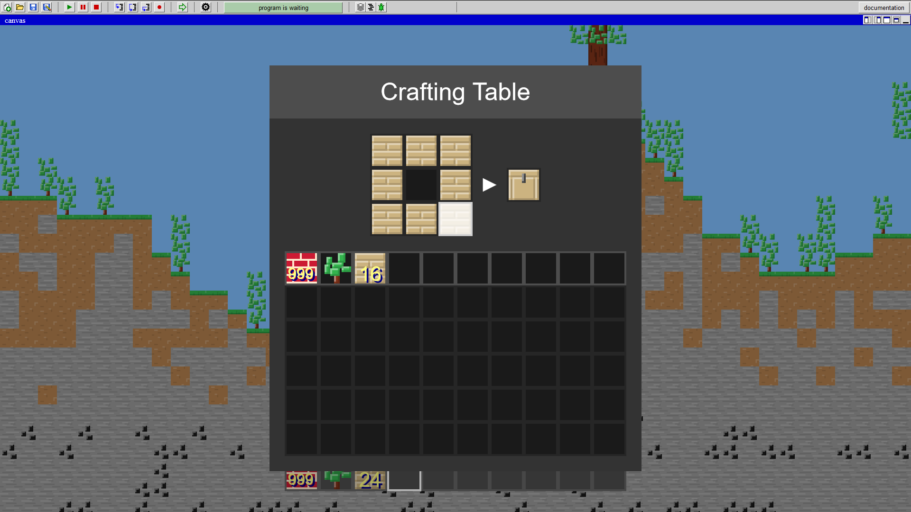
You can use the workbench to create different things

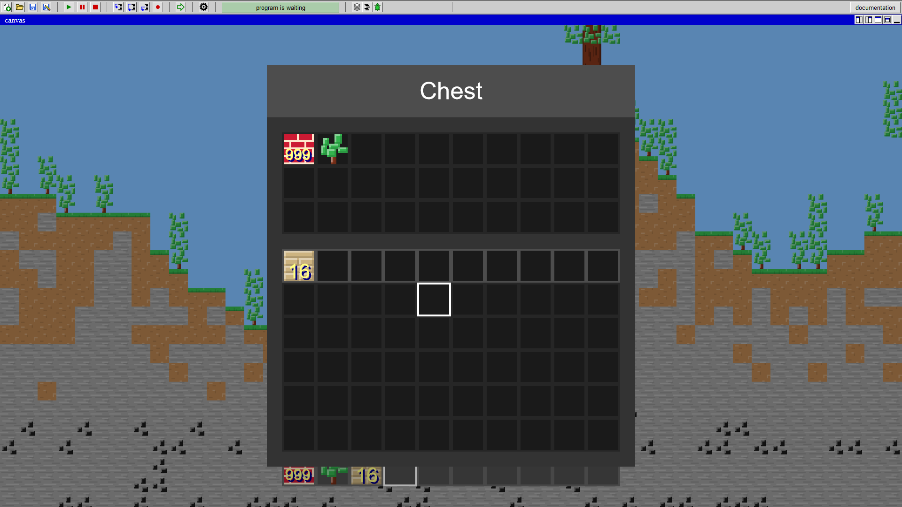
Chests can be used to store items (currently these work as black holes :D)

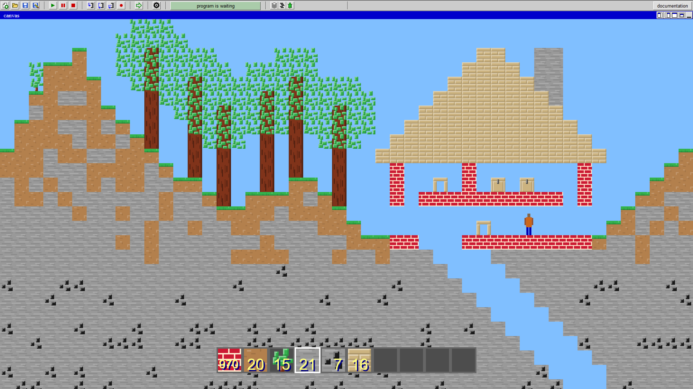
You can build a big base

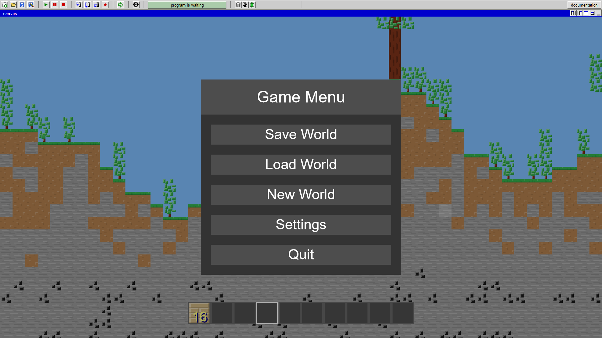
Pressing escape gives you different options

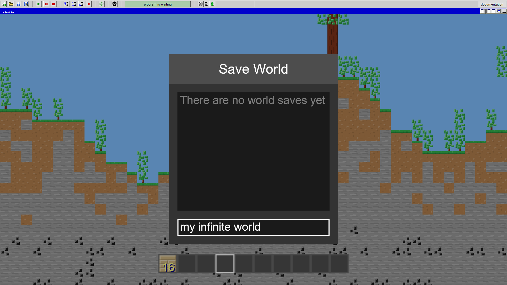
You can save your world

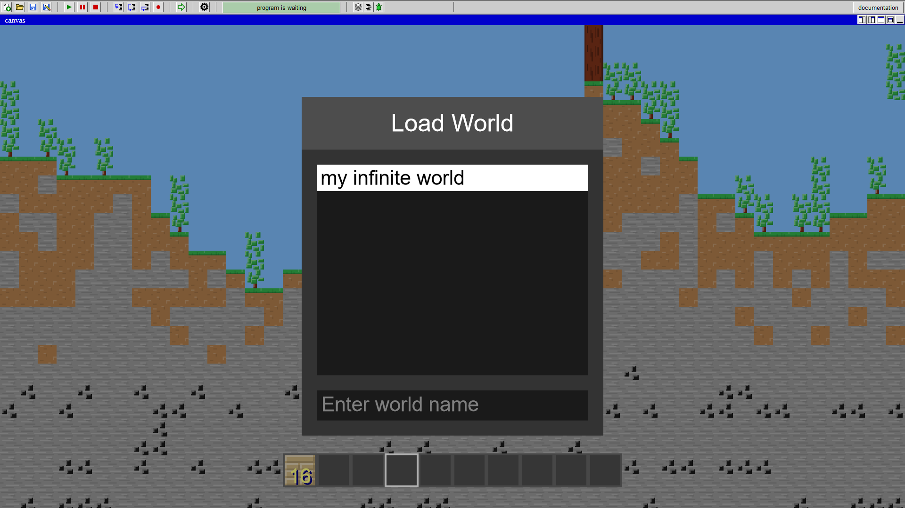
And you can reload your world later

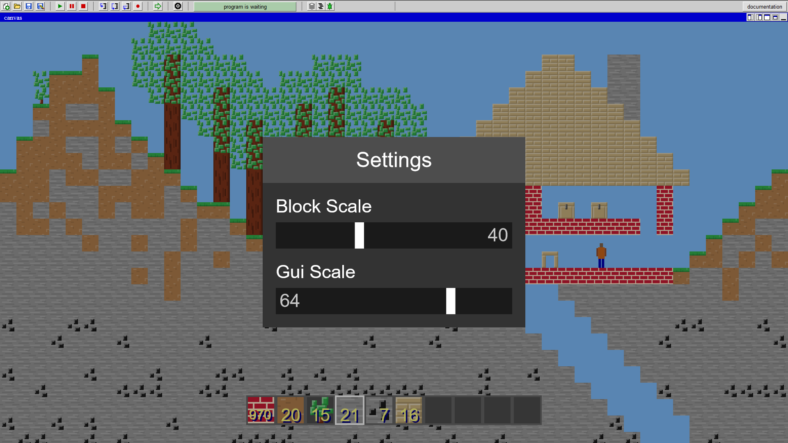
Settings to increase or decrease size of graphical elements
